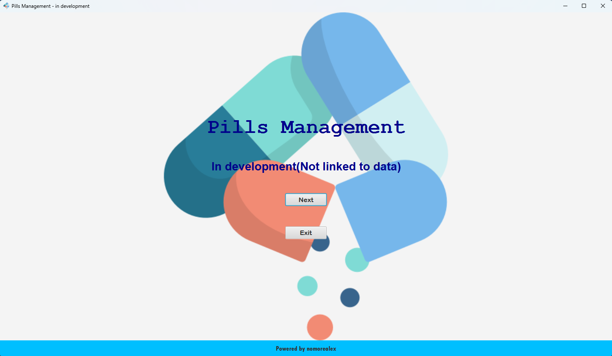
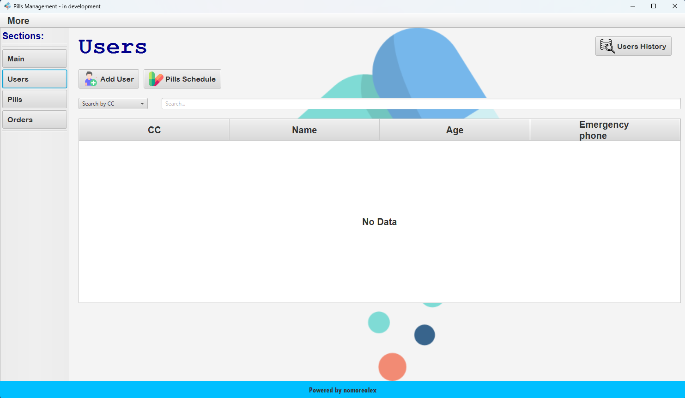
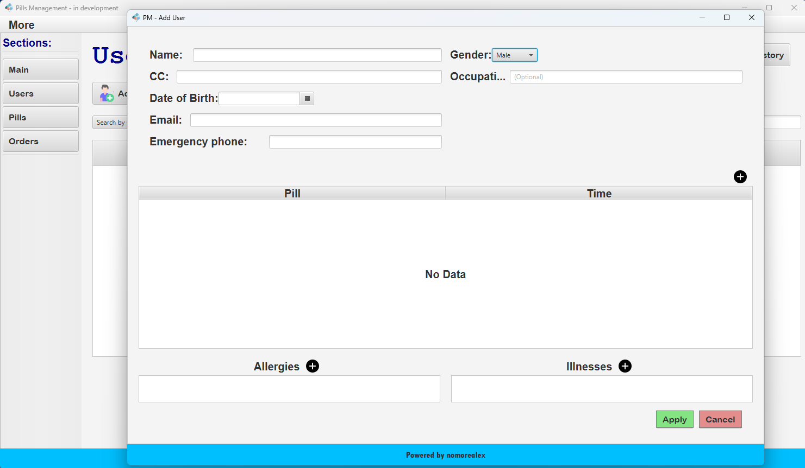

# MedManagement - In Development

## Clone this repository via `https` or `ssh` keys

--------

```bash
git clone https://github.com/nomorealex/MedManagement.git
```


## Run database (Docker)

--------
**CMD**

```
set PASS=password123!

docker run -v C:\path\to\postgresfarma.sql:/docker-entrypoint-initdb.d/init.sql -p 5432:5432 -e POSTGRES_PASSWORD=%PASS% postgres
```

--------
**Powershell**

```
$Env:PASS = 'password123!'

docker run -v C:\path\to\postgresfarma.sql:/docker-entrypoint-initdb.d/init.sql -p 5432:5432 -e POSTGRES_PASSWORD=$Env:pass postgres
```

--------
**Linux**

```
export PASS=password123!

docker run -v /path/to/postgresfarma.sql:/docker-entrypoint-initdb.d/init.sql -p 5432:5432 -e POSTGRES_PASSWORD=${PASS} postgres
```

## Compile and Run

---------

> To compile and run, it was used the `Java-Jdk17` and `JavaFX-sdk-17.0.7`

### From src directory run:

**Windows**
```
javac -encoding UTF-8 -d ..\out --module-path "C:\path\to\javafx-sdk-..\lib" --add-modules javafx.controls,javafx.media,javafx.graphics ".\pt\nomorealex\medmanagement\Main.java"
```
```
java -cp ..\out --module-path "C:\path\to\javafx-sdk-..\lib" --add-modules javafx.controls,javafx.media,javafx.graphics pt.nomorealex.medmanagement.Main
```

**Linux**

```
javac -encoding UTF-8 -d ../out --module-path /path/to/javafx-sdk-../lib --add-modules javafx.controls,javafx.media,javafx.graphics ./pt/nomorealex/medmanagement/Main.java
```
```
java -cp ../out --module-path /path/to/javafx-sdk-../lib --add-modules javafx.controls,javafx.media,javafx.graphics pt.nomorealex.medmanagement.Main
```

## Layout

------
#### Initial Page:


#### Users Tab:


#### Add User Secondary Tab:
